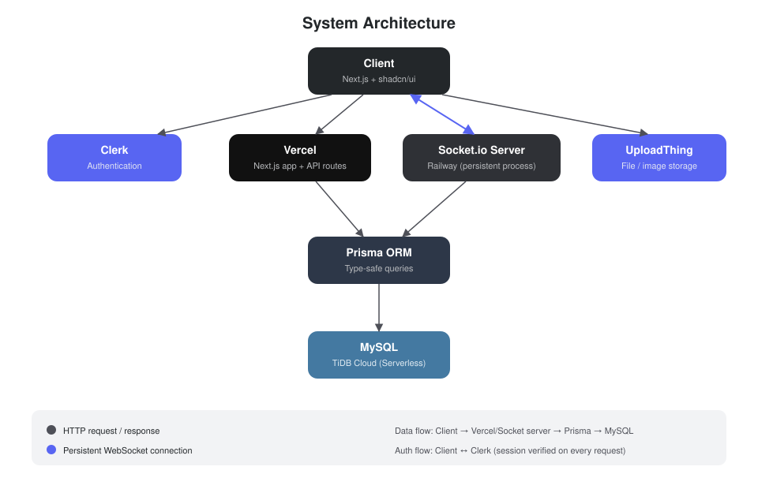

# 💬 NodeSync

A full-stack real-time chat application inspired by Discord — built to explore
WebSocket architecture, relational data modeling, and production-grade auth.

 

 

 

## ✨ Features

- 🔐 **Authentication** — sign up, sign in, session management via Clerk
- 💬 **Real-time messaging** — instant send/receive with typing indicators & presence
- 🗂️ **Servers & channels** — create, join, and manage text channels
- 🧑‍🤝‍🧑 **Direct messages** — 1:1 conversations outside of servers
- 📎 **File uploads** — image and file attachments in messages
- 🔒 **Role-based permissions** — owner / admin / member access control

## 🛠️ Tech Stack

| Layer | Tech | Why |
|---|---|---|
| Framework | **Next.js** (App Router) | SSR + API routes in one codebase |
| UI | **shadcn/ui** + Tailwind | Owned components, no CSS fights |
| Auth | **Clerk** | Production-grade auth without rolling your own |
| ORM | **Prisma** | Type-safe queries, tracked migrations |
| Database | **MySQL** (TiDB Cloud) | Relational fit for servers → channels → messages |
| Real-time | **Socket.io** | Persistent connections for instant messaging |
| File storage | **UploadThing** | Offloaded object storage, not on-server files |
| Hosting | **Vercel** + **Railway** | Serverless frontend, persistent socket server |

## 🏗️ Architecture

  

## 📝 What I Learned

- Managing WebSocket connections separately from serverless HTTP infrastructure
- Modeling many-to-many relationships (users ↔ servers) with a join table
- Handling optimistic UI updates for a snappier real-time feel

## 📄 License

MIT

